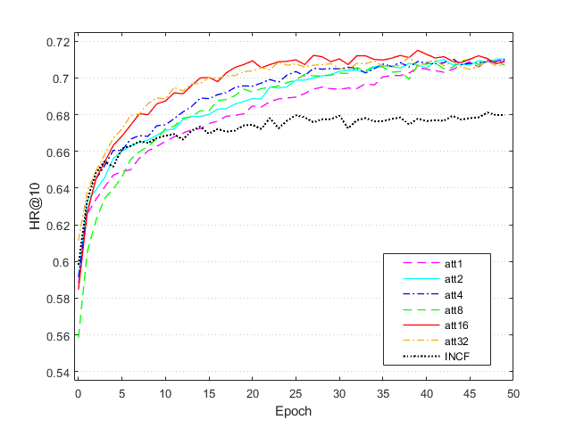
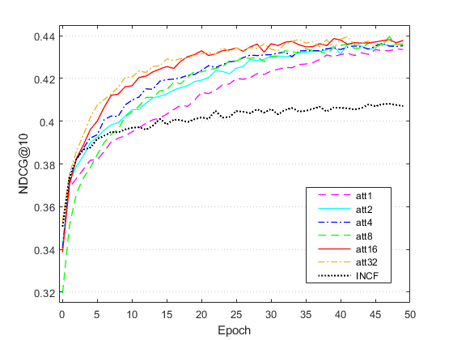

# Deep-Attentive-Interest-Collaborative-Filtering-for-Recommender-Systems

# DAICF
TensorFlow Implementation of Deep Attentive Interest Collaborative Filtering Model for Recommender systems


deep collaborative filtering models: **DAICF** . To target the models for implicit feedback and ranking task, we optimize them using log loss with negative sampling.


## Environment Settings
- Python: '3.6'
- TensorFlow: 'r1.0'
- Numpy: '1.13'

## Examples to run the codes
Run **DAICF** :
```
python DAICF.py --path Data/ --dataset ml-1m --epochs 50 --verbose 1 --batch_choice fixed:256 --embed_size 16 --layers [64,32,16] --regs [1e-06,1e-06] --reg_W [0.1,0.1,0.1,0.1] --alpha 0.5 --train_loss 1 --num_neg 4 --lr 0.01 --batch_norm 1 --pretrain 0
```
Output of **DAICF**:  

**figure**
...  
  



**out**
- .out file

**result**
- .csv file

## Datasets
We provide four processed datasets:  Pinterest (pinterest-20), Amazom_office, digital_music, and MovieLens 1 Million (ml-1m).

**train.rating:**
- Train file.
- Each Line is a training instance: userID\t itemID\t rating\t timestamp (if have)

**test.rating:**
- Test file (positive instances).
- Each Line is a testing instance: userID\t itemID\t rating\t timestamp (if have)

**test.negative:**
- Test file (negative instances).
- Each line corresponds to the line of test.rating, containing 99 negative samples.
- Each line is in the format: (userID,itemID)\t negativeItemID1\t negativeItemID2 ...

Update Date: June 02, 2020
=======
# Deep-Attentive-Interest-Collaborative-Filtering-for-Recommender-Systems
>>>>>>> 31ba0b1ca93edcea5dcc1765fe3ab499c4c8d50f
